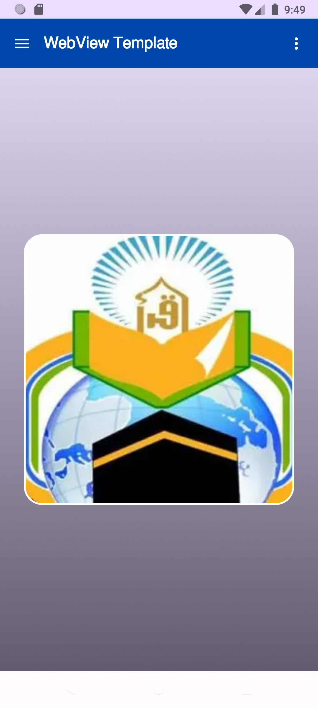
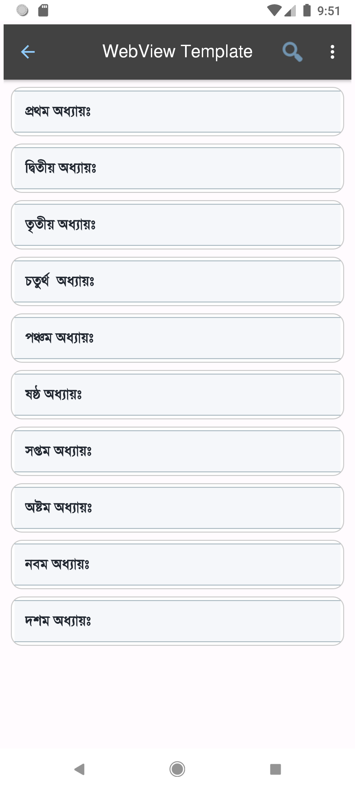
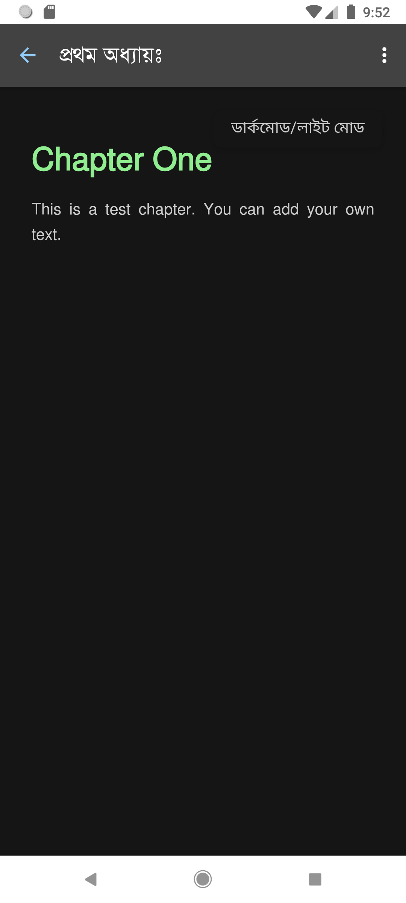
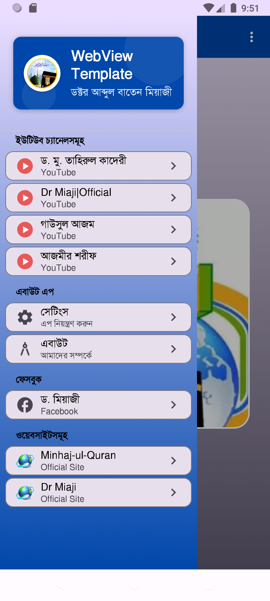
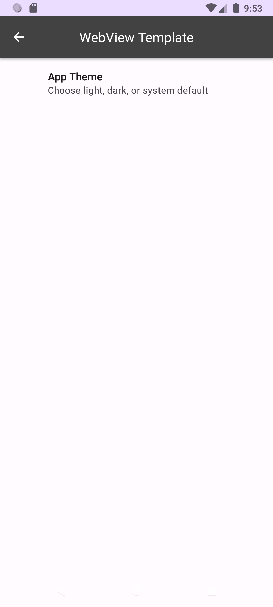

# WebViewTemplate

---

## 📱 WebView Android অ্যাপ (বাংলা)

এটি একটি হালকা ও ব্যবহারযোগ্য Android WebView টেমপ্লেট। আপনি এটি ফর্ক করে খুব সহজেই আপনার কনটেন্ট যোগ করতে পারবেন।

---

### ✅ ব্যবহারের নিয়ম

- এই রেপোজিটোরিটি **Fork/Clone** করুন Android Studio-তে  
- আপনার প্রয়োজন অনুযায়ী কোড এবং অ্যাসেট পরিবর্তন করুন  
- নিজের অধ্যায়, স্টাইল বা স্ক্রিপ্ট যুক্ত করুন  

---

### 📁 অন্তর্ভুক্ত ফাইলসমূহ

- `assets/contents/topics/` → ১০টি নমুনা অধ্যায়  
- `assets/contents/index.json` → অধ্যায়ের সূচিপত্র  
- `style.css`, `script.js`, `base.html` → WebView রেন্ডারিংয়ের জন্য  
- **ফন্ট**:  
  - `SolaimanLipi.ttf` → বাংলা  
  - `IndoPak.ttf` → আরবি (কুরআনিক)

---

### 🛠️ প্রযুক্তি ও সংস্করণ

- 🎯 **Target SDK**: ৩৫  
- 📦 **ডিপেন্ডেন্সি**: সর্বশেষ আপডেটেড

---

### ✨ ফিচারস

- 🌐 WebView দ্বারা HTML কনটেন্ট দেখানো  
- 📚 RecyclerView দিয়ে অধ্যায় তালিকা  
- 🔍 সূচিপত্র সার্চ ফিচার  
- 🧩 `MainActivity`-তে Jetpack Compose  
- ☰ Navigation Drawer  
- 📋 Grouped Drawer Menu  
- ⚙️ DropdownMenuItem (যেমনঃ Privacy Policy)

---

## 🌐 Android WebView Template (English)

A lightweight, simple, and customizable WebView Android template. Perfect for apps that display local HTML/CSS/JS content.

---

### ✅ How to Use

- **Fork/Clone** this repo into Android Studio  
- Replace content in `assets/` as needed  
- Add your chapters, scripts, and stylesheets  

---

### 📁 Included Files

- `assets/contents/topics/` → 10 sample chapters  
- `assets/contents/index.json` → JSON index  
- `style.css`, `script.js`, `base.html` → WebView rendering  
- **Fonts**:  
  - `SolaimanLipi.ttf` → Bengali  
  - `IndoPak.ttf` → Arabic/Quranic

---

### 🛠️ Tech Stack

- 🎯 Target SDK: 35  
- 📦 Dependencies: All up-to-date

---

### ✨ Features

- 🌐 Local HTML WebView content  
- 📚 RecyclerView for chapter navigation  
- 🔍 Search function in index  
- 🧩 Jetpack Compose used for `MainActivity`  
- ☰ Navigation Drawer  
- 📋 Grouped drawer items  
- ⚙️ Dropdown menus (e.g. Privacy Policy)

---

## 📸 Screenshots

| Home Screen | WebView | Dark Mode | Navigation | Mode |
|-------------|---------|-----------|------------|------|
|  |  |  |  |  |

---

## 🙏 Contributions & Feedback

Pull requests and suggestions are welcome.  
If this helps you, please consider giving a ⭐️ to the repo.

---

## 📄 License

This project is licensed under the [MIT License](LICENSE).
